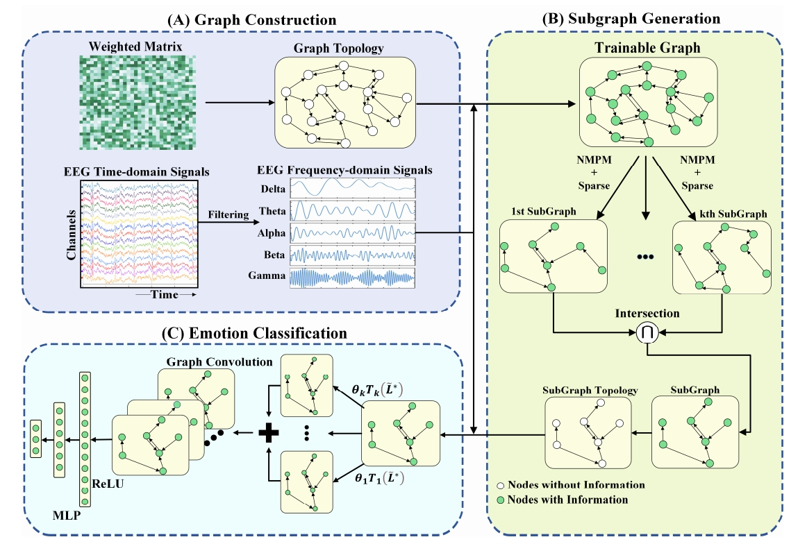
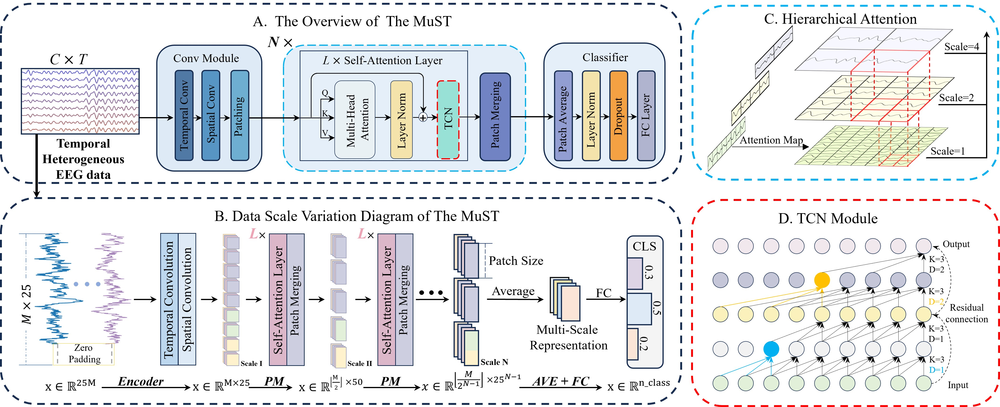

## 
 ——2026届硕士研究生——

#### 
  :small_blue_diamond::small_blue_diamond::small_blue_diamond::small_blue_diamond::small_blue_diamond:&emsp;赵奎&emsp;:small_blue_diamond::small_blue_diamond::small_blue_diamond::small_blue_diamond::small_blue_diamond:

    

        &emsp;&emsp;赵奎，计算机学院计算机技术专业2023级硕士研究生，师从张枢教授。在攻读硕士期间，以第一作者发表论文两篇，包括一篇SCI一区期刊，合作参与发表论文数十篇，申请发明专利一项；多次参加竞赛并获奖。硕士毕业后将前往华为科技有限公司就业。

   
&emsp;**毕业去向**：华为科技有限公司

&emsp;**毕业寄语**：天行健，君子以自强不息。

### · 研究方向

EEG脑电信号处理，脑机接口

### · 邮箱

kui.zhao@mail.nwpu.edu.cn

### · 代表论文
| 方法                                  | 题目                                                                                                                                                                                                                                                                          | 链接                  |
| ------------------------------------- | ----------------------------------------------------------------------------------------------------------------------------------------------------------------------------------------------------------------------------------------------------------------------------- | --------------------- |
|  | Shu Zhang, **Kui Zhao**, Yangqing Kang, Enze Shi, Di Zhu. A Self-Adaptive Subgraph Generation Algorithm for EEG Channel Selection[C]//2024 IEEE International Symposium on Biomedical Imaging (ISBI). IEEE, 2024:1-5. | [[PaperLink]]() [[Code]]() |
|                                       |                                                                                                                                                                                                                                                                               |                       |

| 方法                                  | 题目                                                                                                                                                                                                                                                                          | 链接                  |
| ------------------------------------- | ----------------------------------------------------------------------------------------------------------------------------------------------------------------------------------------------------------------------------------------------------------------------------- | --------------------- |
|  | Shu Zhang, **Kui Zhao**, Di Zhu, Sigang Yu, Geng Chen, Shijie Zhao. MuST: Multi-Scale Transformer Incorporating Hierarchical Attention and TCN for EEG Decoding[C].//IEEE Journal of Biomedical and Health Informatics(JBHI),2026. | [[PaperLink]]() [[Code]]() |
|                                       |                                                                                                                                                                                                                                                                               |                       |
                                       |   
                                                                       
### · 出版论文

[1] Shu Zhang, **Kui Zhao**, Yangqing Kang, Enze Shi, Di Zhu. A Self-Adaptive Subgraph Generation Algorithm for EEG Channel Selection[C]//2024 IEEE International Symposium on Biomedical Imaging (ISBI). IEEE, 2024:1-5.

[2] Shu Zhang, **Kui Zhao**, Di Zhu, Sigang Yu, Geng Chen, Shijie Zhao. MuST: Multi-Scale Transformer Incorporating Hierarchical Attention and TCN for EEG Decoding.//IEEE Journal of Biomedical and Health Informatics(JBHI),2026.
 