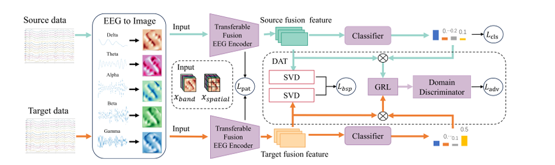
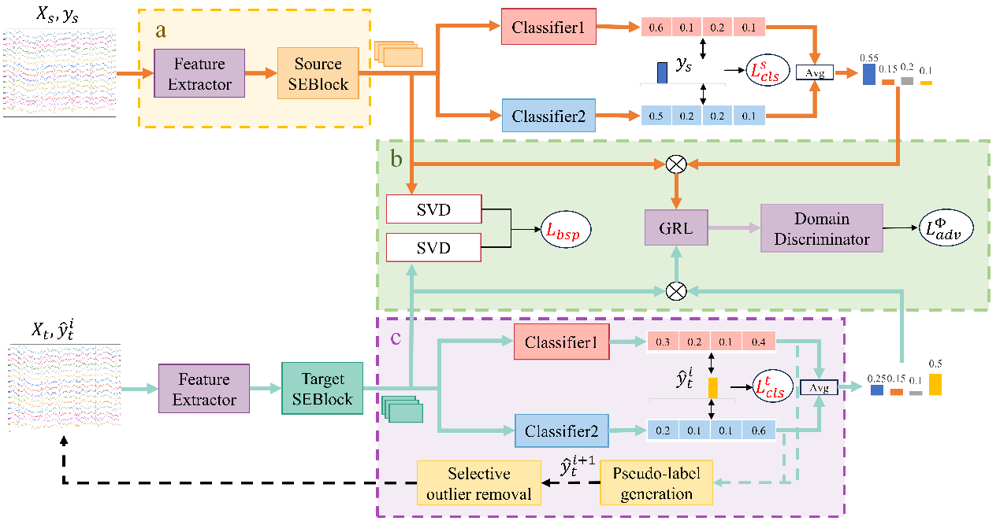

---
author: hyzhang
title: "袁麒龙"
date: 2022-09-01T03:19:20+08:00
summary: 硕士研究生
categories: Members
tags: Members
featured_image: ../assets/images/featured/members/qilong-yuan.jpg
---
## 
 ——2026届硕士研究生——

#### 
  :small_blue_diamond::small_blue_diamond::small_blue_diamond::small_blue_diamond::small_blue_diamond:&emsp;袁麒龙&emsp;:small_blue_diamond::small_blue_diamond::small_blue_diamond::small_blue_diamond::small_blue_diamond:

    

        &emsp;&emsp;康艳晴，计算机学院2024届硕士研究生，师从张枢教授，研究方向为大脑功能与结构一致性研究。在校期间曾获一等学业奖学金、校优秀毕业生、校优秀研究生等奖励及荣誉。以学生第一作者发表两篇论文（一篇医学影像顶会，一篇EI 会议），在投SCI二区一篇，作为共同作者参与并发表高水平论文6篇，申请并公开国家发明专利1项，参与西北工业大学研究生创新基金1项。毕业后，她将入职西安中兴新软件有限责任公司，在工作岗位上继续努力。

&emsp;**毕业去向**：西安中兴新软件有限责任公司

&emsp;**毕业寄语**：没有一个冬天不可逾越，没有一个春天不会来临。
    

### · 研究方向
EEG脑电信号分析，脑机接口

### · 邮箱
qilongyuan@mail.nwpu.edu.cn

### · 代表论文

| 方法                | 题目                                                         | 链接                       |
| ----------------------- | ------------------------------------------------------------ | -------------------------- |
|  | Shu Zhang, **Qilong Yuan**, Enze Shi, Di Zhu, Xiaoshan Zhang, Dingwen Zhang, Tianming Liu. TF‐MEET:A Transferable Fusion Multi‐band Transformer for Cross‐Session EEG Decoding. CAAI Transactions on Intelligence Technology.| [[PaperLink]]() [[Code]]() |

| 方法                | 题目                                                         | 链接                       |
| ----------------------- | ------------------------------------------------------------ | -------------------------- |
|  | Shu Zhang, **Qilong Yuan**, Kui Zhao, Di Zhu, Dingwen Zhang. A Smooth Conditional Domain Adversarial Training Framework for EEG Motor Imagery Decoding. //2024 IEEE International Conference on Bioinformatics and Biomedicine (BIBM). IEEE, 2024.| [[PaperLink]]() [[Code]]() |

### · 出版论文
[1] Shu Zhang, **Qilong Yuan**, Enze Shi, Di Zhu, Xiaoshan Zhang, Dingwen Zhang, Tianming Liu. TF‐MEET:A Transferable Fusion Multi‐band Transformer for Cross‐Session EEG Decoding. CAAI Transactions on Intelligence Technology.

[2] Shu Zhang, **Qilong Yuan**, Kui Zhao, Di Zhu, Dingwen Zhang. A Smooth Conditional Domain Adversarial Training Framework for EEG Motor Imagery Decoding. //2024 IEEE International Conference on Bioinformatics and Biomedicine (BIBM). IEEE, 2024.

