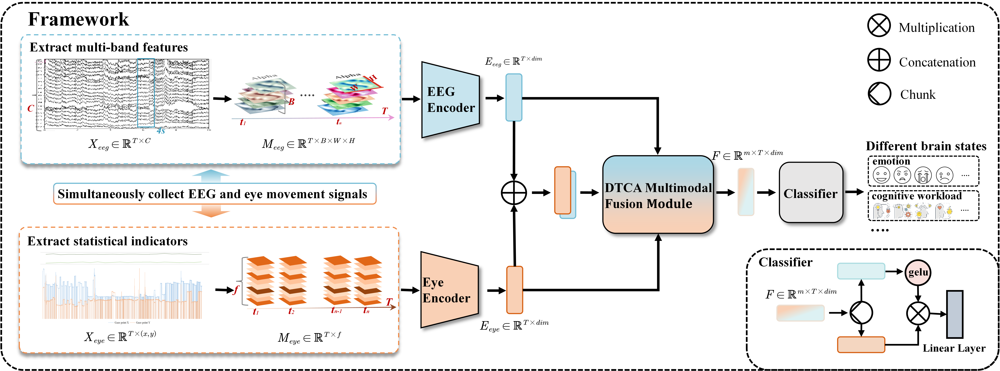

## 
 ——2026届硕士研究生——

#### 
  :small_blue_diamond::small_blue_diamond::small_blue_diamond::small_blue_diamond::small_blue_diamond:&emsp;张晓珊&emsp;:small_blue_diamond::small_blue_diamond::small_blue_diamond::small_blue_diamond::small_blue_diamond:

    

        &emsp;&emsp;张晓珊，计算机学院计算机技术专业2023级硕士，师从张枢教授。在攻读硕士期间，以第一作者身份在CCF-B类会议发表论文1篇，获已授权专利一项，并参与合作了多篇高水平论文；获得了第23届“三航杯”创新大赛银奖等多个奖项。曾荣获学业一等奖学金、吴亚军三等奖学金、优秀研究生以及优秀毕业生等多项荣誉。硕士毕业后，将在赛力斯集团从事算法研究工作。

   
&emsp;**毕业去向**：赛力斯集团

&emsp;**毕业寄语**：道阻且长，行则将至；行而不辍，未来可期。

### · 研究方向

EEG与眼动多模态脑机接口研究

### · 邮箱

haiyang.zhang@mail.nwpu.edu.cn

### · 代表论文
| 方法                                  | 题目                                                                                                                                                                                                                                                                          | 链接                  |
| ------------------------------------- | ----------------------------------------------------------------------------------------------------------------------------------------------------------------------------------------------------------------------------------------------------------------------------- | --------------------- |
|  | Shu Zhang, **Xiaoshan Zhang**, Enze shi, Sigang Yu. DTCA:Dual-Branch Transformer with Cross-Attention for EEG and Eye Movement Data Fusion[C]//International Conference on Medical Image Computing and Computer-Assisted Intervention. Cham:Springer Nature Switzerland, 2024:141-151.| [[PaperLink]]() [[Code]]() |
|                                       |                                                                                                                                                                                                                                                                               |                       |

                                                                                                                                                                                              |                       |

### · 出版论文

[1] Shu Zhang, **Xiaoshan Zhang**, Enze shi, Sigang Yu. DTCA:Dual-Branch Transformer with Cross-Attention for EEG and Eye Movement Data Fusion[C]//International Conference on Medical Image Computing and Computer-Assisted Intervention. Cham:Springer Nature Switzerland, 2024:141-151.
