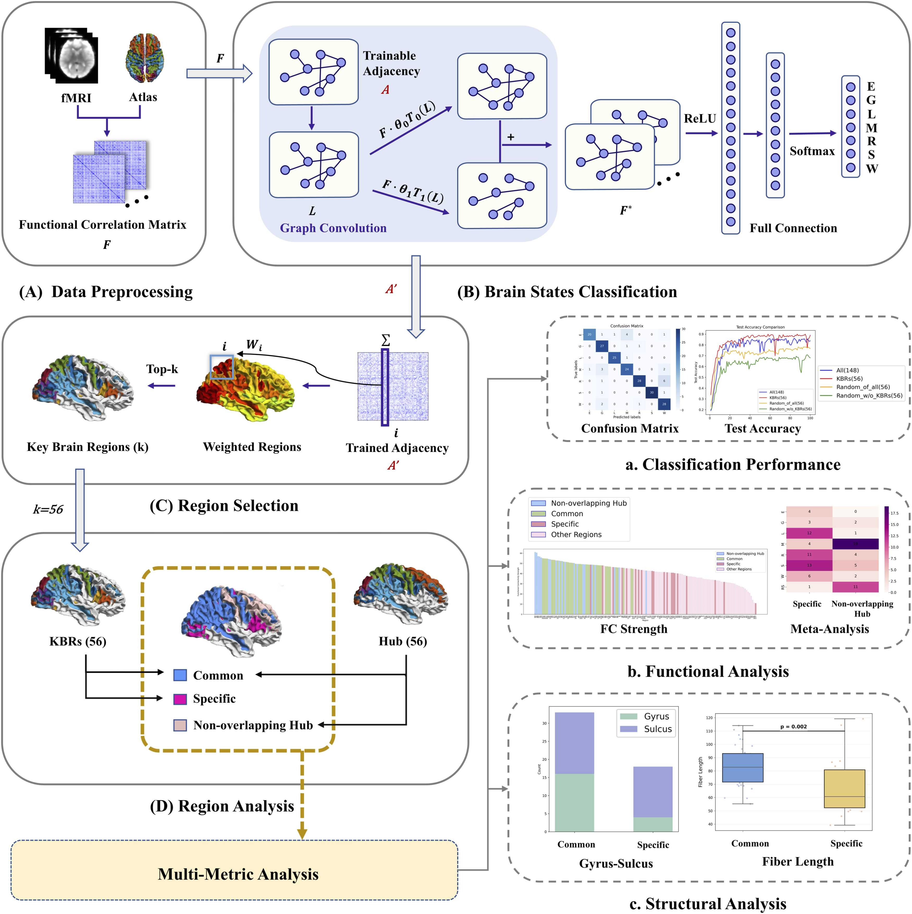

## 
 ——2026届硕士研究生——

#### 
  :small_blue_diamond::small_blue_diamond::small_blue_diamond::small_blue_diamond::small_blue_diamond:&emsp;朱迪&emsp;:small_blue_diamond::small_blue_diamond::small_blue_diamond::small_blue_diamond::small_blue_diamond:

    

        &emsp;&emsp;朱迪，计算机学院2026届硕士研究生，师从张枢教授，中共党员，研究方向为大脑的结构与功能特性。在校期间曾担任班级团支部书记，曾获优秀研究生、优秀毕业生等多项荣誉。以第一作者在SCI二区期刊发表论文一篇，ei会议一篇，作为共同作者参与并发表高水平论文5篇，申请专利一项。毕业后，她将入职阿里云公司，在工作岗位上继续努力。

   
&emsp;**毕业去向**：阿里云

&emsp;**毕业寄语**：路遥知马力，大家继续加油！

### · 研究方向

大脑功能与结构一致性研究

### · 邮箱

di_zhu@mail.nwpu.edu.cn

### · 代表论文
| 方法                                  | 题目                                                                                                                                                                                                                                                                          | 链接                  |
| ------------------------------------- | ----------------------------------------------------------------------------------------------------------------------------------------------------------------------------------------------------------------------------------------------------------------------------- | --------------------- |
|  | Shu Zhang, **Di Zhu**, Sigang Yu, Qilong Yuan, Kui Zhao, Yangqing Kang, Tuo Zhang, Xi Jiang, Tianming Liu. Characterizing and Differentiating Brain States through A CS-KBRs Framework for Highlighting the Synergy of Common and Specific Brain Regions[J]. Computerized Medical Imaging and Graphics, 2025:102609.| [[PaperLink]]() [[Code]]() |
|                                       |                                                                                                                                                                                                                                                                               |                       |

### · 出版论文

[1] Shu Zhang, **Di Zhu**, Sigang Yu, Qilong Yuan, Kui Zhao, Yangqing Kang, Tuo Zhang, Xi Jiang, Tianming Liu. Characterizing and Differentiating Brain States through A CS-KBRs Framework for Highlighting the Synergy of Common and Specific Brain Regions[J]. Computerized Medical Imaging and Graphics, 2025:102609. 
